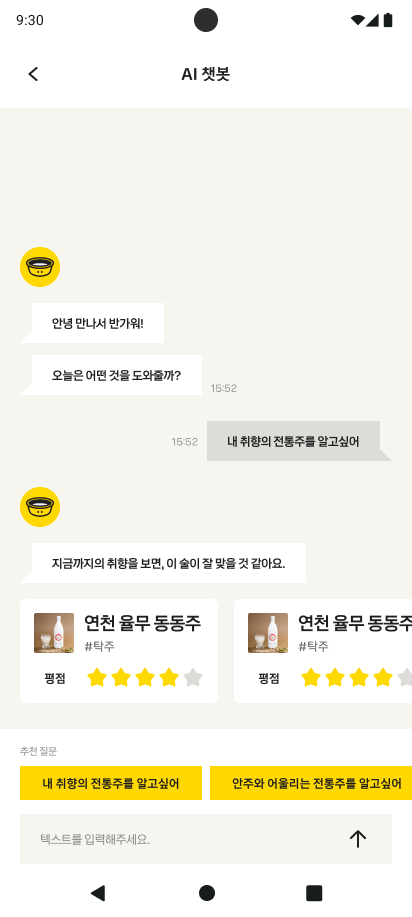
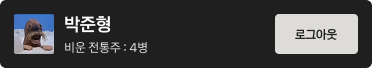
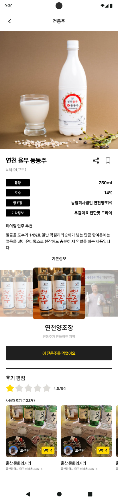
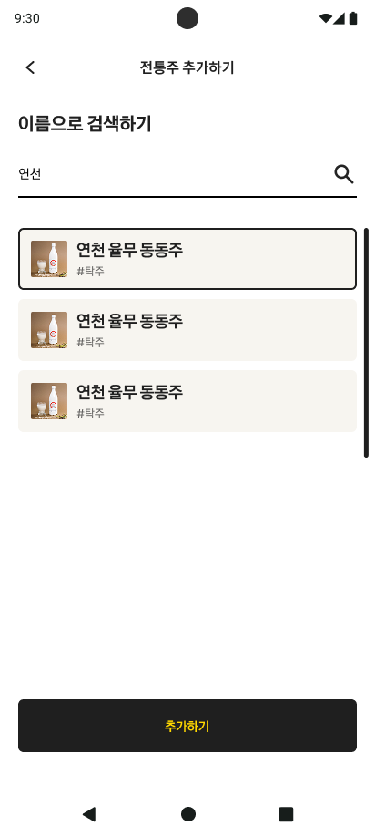
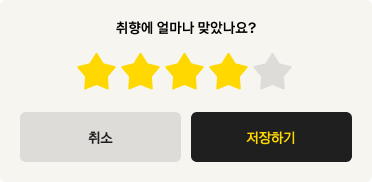
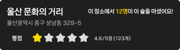
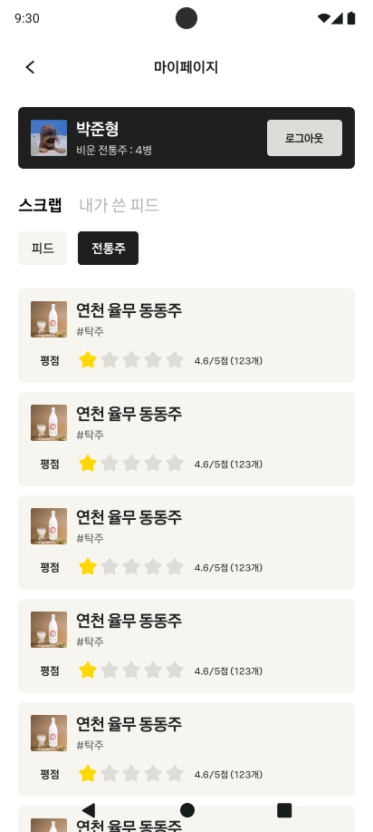
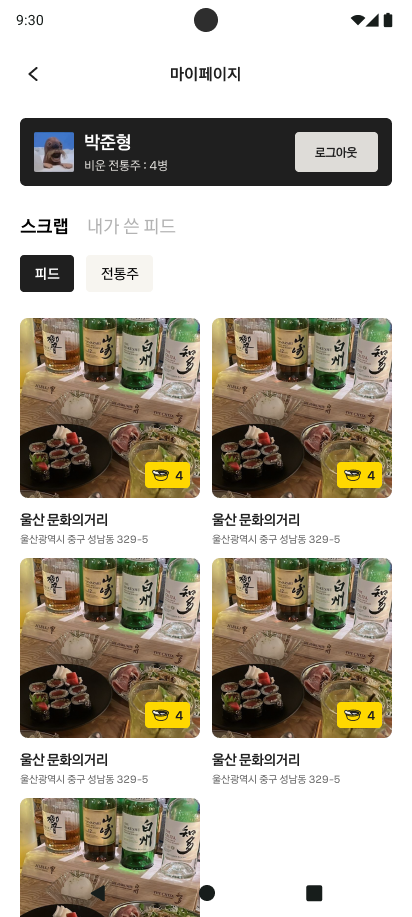
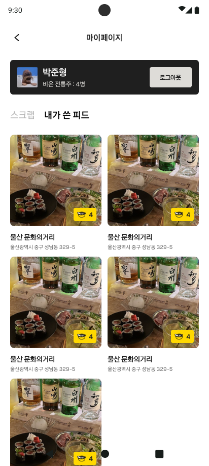
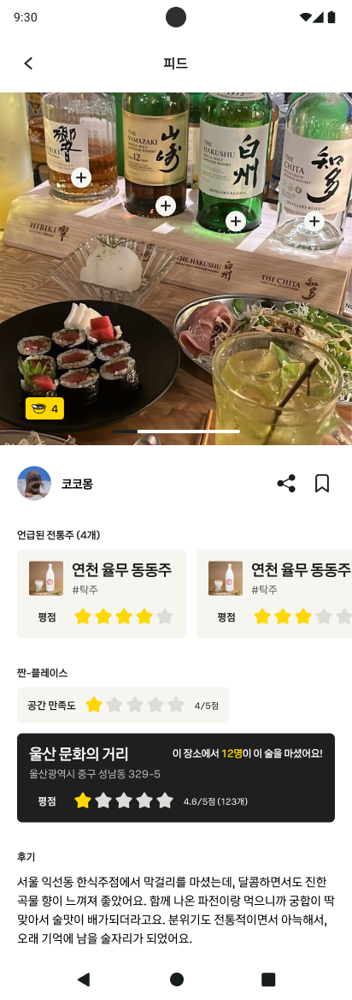

# API Description for FE
프론트엔드에서 상황에 맞게 사용할 BE API 목록입니다.

 

## 채팅 (chat)
### [GET] 답변 받기
**화면 -** 채팅하기

**BE API -** `{{baseUrl}}/chat`

**Request Body:**  
| parameter | type | meaning | example |
| --- | --- | --- | --- |
| `query` | `string` | 사용자가 보내는 답변 | 달달한 전통주 추천해줘
| `history` | `string` | 이전 기록 | [~~~]

> 얻은 술 정보에 대해 프론트에서 component로 출력하기

 

## 유저 (users)

### [POST] 모바일용 카카오 로그인
**화면 -** 로그인 화면

**BE API -** `{{baseUrl}}/users/auth/kakao/login`

**Request Body:**
| parameter | type | meaning |
| --- | --- | --- |
| `accessToken` | `string` | 카카오 액세스 토큰 |

**Response:**
| parameter | type | meaning |
| --- | --- | --- |
| `accessToken` | `string` | 서버 액세스 토큰 |
| `refreshToken` | `string` | 서버 리프레시 토큰 |

 

### [POST] 로그아웃
**화면 -** 마이페이지 

 

[**보완 or 궁금한 점**]

**로그아웃 백엔드 API 명세서가 안보인다.**  

 

## 전통주 (liquors)

### [GET] 전통주 상세 페이지 정보
**화면 -** `app/(info)/alchol.tsx`

**BE API -** `{{baseUrl}}/liquors/:liquorId`

**Response:**
| parameter | type | meaning | example |
| --- | --- | --- | --- |
| `id` | `string` | 전통주 ID | 01K3VHDGBTHG5T48XM868M2XHT |
| `imageUrl` | `string` | 전통주 사진 | https://zzan-liquor-bucket.s3.amazonaws.com/liquor-images/01K3VH8FCNJ1QYTHGJBQX5GM8E.png |
| `name` | `string` | 전통주 이름 | 연천 율무 동동주 |
| `type` | `string` | 전통주 카테고리 | 탁주(고도) |
| `volume` | `string` | 용량 | 750ml |
| `content` | `string` | 도수 | 6% |
| `brewery` | `string` | 양조장 | 농업회사법인 연천양조㈜ |
| `etc` | `string` | 기타정보 | 무감미료 진한맛 드라이 |
| `foodPairing` | `string` | 페어링 안주 추천 | 알콜올 도수가 14%로 일반 막걸리의 2배가 넘는 만큼... |
| `score` | `number` | 평점 | 4.7 |

 

[**보완 or 궁금한 점**]

**`기본 정보`에 대한 API가 없다. (image, description, tag)**  
이 기능을 추가하기엔 데이터가 많이 필요하므로, 프론트에서 mock data로 처리하는 게 좋아보인다.

**`전체 리뷰` 백엔드 API가 있으면 좋겠다.**  
'내 리뷰 가져오기' 기능은 있지만, 어떤 술에 대한 전체 리뷰를 가져오는 API가 없다.

 

### [GET] 전통주 검색
**화면 -** `app/(feed)/add.tsx` (전통주 추가하기)

**BE API -** `{{baseUrl}}/liquors?keyword={keyword}&size={size}&page={page}`

**Query Parameters:**
| parameter | type | meaning | example |
| --- | --- | --- | --- |
| `keyword` | `string` | 검색어 | 가평 |
| `size` | `number` | 최대로 보여주는 전통주 수 | 10 |
| `page` | `number` | 페이지 | 1 |

> `size`랑 `page`는 프론트에서 알아서 처리

 

### [POST] 전통주 리뷰 추가
**화면 -** `app/(info)/alchol.tsx` (`RateAlcholButton` 클릭 시)

**BE API -** `{{baseUrl}}/liquors/:liquorId/reviews?userId={userId}`

**Request Body:**
| parameter | type | meaning | example |
| --- | --- | --- | --- |
| `score` | `number` | 평점 | 4 |
| `text` | `string` | 리뷰 내용 | 맛있네요 |

>`text`는 현재 화면에 없으므로, 프론트에서 일괄적인 내용 보내기

 

### [PUT] 리뷰 업데이트
**화면 -** `app/(info)/alchol.tsx`

**BE API -** `{{baseUrl}}/liquors/:liquorId/reviews?userId={userId}`

**Request Body:**
| parameter | type | meaning | example |
| --- | --- | --- | --- |
| `score` | `number` | 평점 | 4.5 |
| `text` | `string` | 리뷰 내용 | 맛있어요 |

>`text`는 현재 화면에 없으므로, 프론트에서 일괄적인 내용 보내기

 

## 짠플레이스 (places)
### [GET] 짠플레이스 상세
**화면 -** `alchol.tsx`

[**보완 or 궁금한 점**]

**`짠플레이스 상세`에 대한 API가 없다.**  
지도에 뜨는 상세 정보는 있지만, 상세 페이지에서의 정보는 없다.

 

### [GET] 짠플레이스 상세 in 지도

**BE API -** `{{baseUrl}}/place/:placeId`

**Response:**  
| parameter | type | meaning | example |
| --- | --- | --- | --- |
| `name` | `string` | 장소 이름 | 
| `address` | `string` | 장소 주소 |
| `averageScore` | `number` | 평점 | 4.5
| `feedCount` | `number` | 평점 개수 | 123

[**보완 or 궁금한 점**]

**"이 장소에서 N명이 이 술을 마셨어요" 정보 부재**  

**`feedCount`가 평점 개수인지, 술을 마신 사람 수인지 궁금하다.**

 

## 마이페이지
### [GET] 스크랩한 전통주
**화면 -** 마이페이지 -> 스크랩 -> 전통주

**BE API -** `{{baseUrl}}/liquors/scraps?userId=string&size=2290&cursor=string`

**Response:**
| parameter | type | meaning | example |
| --- | --- | --- | --- |
| `liquorImageUrl` | `string` | 술 이미지 | ~.png
| `liquorName` | `string` | 술 이름 | 오곡 진상주
| `liquorType` | `string` | 술 태그 | 탁주(고도)
| `liquorScore` | `number` | 술 평점 | 4.6

 

### [GET] 스크랩한 피드
**화면 -** 마이페이지 -> 스크랩 -> 피드

**BE API -** `{{baseUrl}}/feeds/scraps?userId=string&size=2290&cursor=string`

**Response:**  
| parameter | type | meaning | example |
| --- | --- | --- | --- |
| `feedImageUrl` | `string` | 피드 이미지 | ~.png
| `placeName` | `string` | 장소 이름 | 울산 문화의거리
| `placeAddress` | `string` | 장소 주소 | 울산광역시 중구 성남동 329-5

 

[**보완 or 궁금한 점**]

**각 피드마다 liquor 개수가 있어야할 것 같다.**  
'스크랩한 리스트 가져오기'에 추가하면 좋아보인다.  

 

### [GET] 내가 쓴 피드
**화면 -** 마이페이지 -> 내가 쓴 피드

 

[**보완 or 궁금한 점**]

**'내가 쓴 피드 목록' 백엔드 API가 필요하다.**   

 

## 피드
### [GET] 피드 상세페이지

**BE API -** `{{baseUrl}}/feeds/:feedId`  

**Response:**  
| parameter | type | meaning | example |
| --- | --- | --- | --- |
| `imageUrl` | `string` | 피드 이미지 | ~.png
| `liquorName` | `string` | 피드 안 술 이름 | 오곡 진상주
| `x` | `number` | 사진에서 해당 술 버튼의 x좌표 | 123.123
| `y` | `number` | 사진에서 해당 술 버튼의 y좌표 | 123.123
| `userName` | `string` | 유저 이름 | 홍길동
| `userProfileImageUrl` | `string` | 유저 프로필 사진 | ~.png
| `score` | `number` | 공간 만족도 | 5 
| `text` | `string` | 후기 | 만족스러웠습니다.

 

> 장소 정보는 다른 api로 가져오면 됨 `{{baseUrl}}/place/:placeId`

 

### [POST] 피드 작성
작성 중..